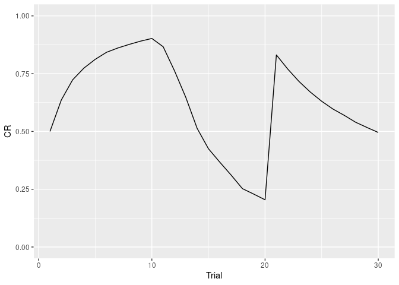
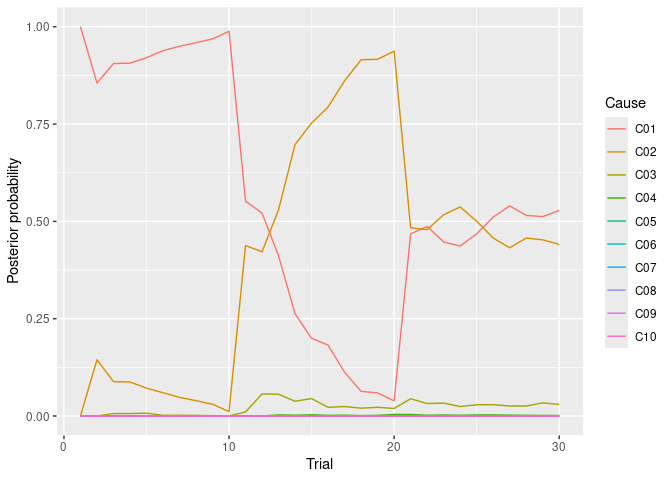
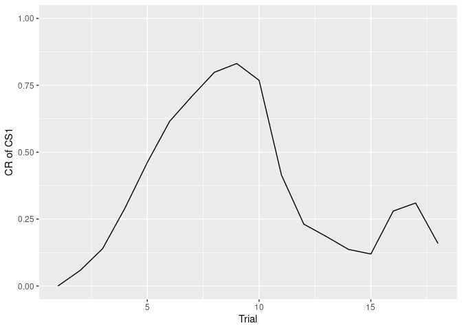
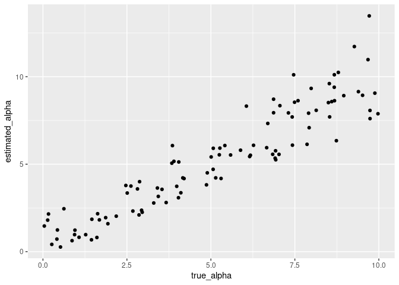

<!-- README.md is generated from README.Rmd. Please edit that file -->

# lcmr

<!-- badges: start -->

[](https://github.com/ykunisato/lcmr)
[](https://www.tidyverse.org/lifecycle/#experimental)
[](https://cran.r-project.org/web/checks/check_results_lcmr.html)
[](https://travis-ci.org/ykunisato/lcmr)
<!-- badges: end -->

The goal of lcmr is to simulate phenomena of classical conditioning and
fit the conditioning data with the latent cause model.

lcmr is an R package of [Latent Cause Model:
LCM](https://github.com/sjgershm/LCM) and [Latent Cause Modulated
Rescorla-Wagner model:
LCM-RW](https://github.com/sjgershm/memory-modification) made by[Sam
Gershman](http://gershmanlab.webfactional.com/people/sam.html).

## Installation

You can install the development version from
[GitHub](https://github.com/) with:

    # install.packages("devtools")
    devtools::install_github("ykunisato/lcmr")

## List of functions

- fit_lcm: Fit model to conditioning data
- infer_lcm: Simulate the classical conditioning with LCM
- infer_lcm_rw: Simulate the classical conditioning with LCM-RW

## How to simulate the renewal effect with LCM

The renewal effect is the phenomenon in which the change of context
after extinction can lead to a return of conditioned response (CR).
infer_lcm(X,opts) can simulate the renewal effect.

First, you have to prepare the design of conditioning. In followings, I
prepare the experimental design consisted from acquisition (CS presents
with US in context A(context = 1), 10 trials), extinction (CS presents
without US in context B(context = 0),10 trials) and test (CS without US
in context A(context = 0), 10 trials).

``` r
US <-      c(1,1,1,1,1,1,1,1,1,1,  0,0,0,0,0,0,0,0,0,0, 0,0,0,0,0,0,0,0,0,0)
CS <-      c(1,1,1,1,1,1,1,1,1,1,  1,1,1,1,1,1,1,1,1,1, 1,1,1,1,1,1,1,1,1,1)
Context <- c(1,1,1,1,1,1,1,1,1,1,  0,0,0,0,0,0,0,0,0,0, 1,1,1,1,1,1,1,1,1,1)
X <- cbind(US, CS, Context)
```

You can simulate the conditioned response using infer_lcm(). I simulate
the conditioned response setting the alpha = 0.4 . The alpha is the
concentrate parameter of the Chinese Restaurant Process.

``` r
library(lcmr)
sim_res <- infer_lcm(X = X, opts = list(c_alpha = 0.4,
                                        K=10,
                                        M=100,
                                        a = 1,
                                        b = 1,
                                        stickiness = 0))
```

You can the plot of change of conditioned response through the trials
using the following codes.

``` r
library(tidyverse)
sim_data <- data.frame(X, Trial = seq(1,length(US)), CR = sim_res$V)

sim_data %>% 
  ggplot(aes(x = Trial, y = CR)) +
  geom_line() +
  ylim(0,1)
```



You can draw the plot of the posterior probability of each cause using
the following codes.

``` r
sim_post <- as.data.frame(sim_res$post) 
sim_post %>% 
  mutate(Trial = seq(1,length(US))) %>% 
  rename(C01 = V1, C02 = V2, C03 = V3, C04 = V4, C05 = V5,
         C06 = V6, C07 = V7, C08 = V8, C09 = V9, C10 = V10) %>% 
  gather(key = "Cause", value = "post",-Trial) %>%
  mutate(Cause = as.factor(Cause)) %>% 
  ggplot(aes(x = Trial, y = post, color = Cause)) +
  geom_line() +
  ylim(0,1) +
  labs(y="Posterior probability")
```



## How to simulate the spontaneous recovery with LCM-RW

The spontaneous recovery is the phenomenon in which the time elapses
following extinction can lead to a return of conditioned response (CR).
infer_lcm_rw(X,opts) can simulate the spontaneous recovery.

First, you have to prepare the design of conditioning. In followings, I
prepare the experimental design consisted from acquisition (CS1 presents
with US, CS2 presents without US, 9 trials each CS), extinction (both
CSs presents without US, 6 trials each CS) and test (both CSs presents
without US after 1 day, 3 trials each CS).

``` r
US  <- c(1,0,0,1,1,0,1,0,1,1,0,0,1,0,0,1,1,0, 0,0,0,0,0,0,0,0,0,0,0,0, 0,0,0,0,0,0)
CS1 <- c(1,0,0,1,1,0,1,0,1,1,0,0,1,0,0,1,1,0, 1,1,0,1,0,0,1,0,1,1,0,0, 1,0,0,1,1,0)
CS2 <- c(0,1,1,0,0,1,0,1,0,0,1,1,0,1,1,0,0,1, 0,0,1,0,1,1,0,1,0,0,1,1, 0,1,1,0,0,1)
time <- c(0, seq(1:17)*4, 100+seq(1:12)*4, 86400+seq(1:6)*4)
X <- cbind(time, US, CS1, CS2)
```

You can simulate the conditioned response using infer_lcm(). I simulate
the conditioned response setting the alpha = 0.45 and the eta = 0.2. The
alpha is the concentrate parameter of the Chinese Restaurant Process and
eta is the learning rate of the RW model.

``` r
library(lcmr)


sim_res <- infer_lcm_rw(X = X, opts = list(
  a = 1,
  b = 1,
  c_alpha = 0.45,
  stickiness = 0,
  K = 10,
  g = 1,
  psi = 0,
  eta = 0.2,
  maxIter= 3,
  w0 = 0,
  sr = 0.4,
  sx = 1,
  theta = 0.3,
  lambda = 0.005,
  K = 15,
  nst = 0))
```

You can the plot of change of conditioned response through the trials
using the following codes.

``` r
library(tidyverse)
sim_data <- data.frame(X,
                       Trials_cs1 = cumsum(CS1),
                       Trials_cs2 = cumsum(CS2),
                       CR = sim_res$V)

sim_data %>% 
  filter(CS1 == 1) %>% 
  ggplot(aes(x = Trials_cs1, y = CR)) +
  geom_line() +
  ylim(0,1) +
  labs(x = "Trial", y = "CR of CS1")
```



``` r

sim_data %>% 
  filter(CS2 == 1) %>% 
  ggplot(aes(x = Trials_cs2, y = CR)) +
  geom_line() +
  ylim(0,1) +
  labs(x = "Trial", y = "CR of CS2")
```


## How to fit LCM to the conditioning data.

You have to prepare the data as long format containing the following
variables (Order and name is exactly the same as following):

- ID Subject ID
- CR Conditioned Response
- US Unconditioned Stimulus
- CS Conditioned Stimului or Context. If using multiple CS, set
  variables name as CS1,CS2,CS3…

I make the synthetic data for model fitting with the experiment design
of the renewal effect.

``` r
US <-      c(1,1,1,1,1,1,1,1,1,1,  0,0,0,0,0,0,0,0,0,0, 0,0,0,0,0,0,0,0,0,0)
CS <-      c(1,1,1,1,1,1,1,1,1,1,  1,1,1,1,1,1,1,1,1,1, 1,1,1,1,1,1,1,1,1,1)
Context <- c(1,1,1,1,1,1,1,1,1,1,  0,0,0,0,0,0,0,0,0,0, 1,1,1,1,1,1,1,1,1,1)
X <- cbind(US, CS, Context)
```

I make synthetic data for 100 participants.

``` r
number_of_perticiapnts <- 100
participants_alpha <- runif(number_of_perticiapnts, 0, 10)
data <- NULL
for (i in 1:number_of_perticiapnts) {
  sim_data <- infer_lcm(X, opts = list(c_alpha = participants_alpha[i],
                                       K=10,
                                       M=100,
                                       a = 1,
                                       b = 1,
                                       stickiness = 0))
  sim_df <- data.frame(ID = rep(i,length(US)), CR = sim_data$V, X)
  data <- rbind(data,sim_df)
}
```

You can estimate parameter alpha using fit_lcm(data, model, opts,
parameter_range, parallel, estimation_method). You have to specify the
following argument for model fitting:

- model: 1 = latent cause model, 2 = latent cause modulated RW model

- parameter_range: range of parameter(a_L, a_U, e_L, e_U)

- stimation_method: 0 = optim or optimize(lcm), 1 = post mean(only
  latent cause model)

``` r
results <- fit_lcm(data, 
                   model = 1, 
                   opts = list(K=10,
                                       M=100,
                                       a = 1,
                                       b = 1,
                                       stickiness = 0),
                   parameter_range = list(a_L = 0, a_U = 15),
                   estimation_method = 0)
#> start estimation using optim... 
#> 1   negative log likelihood:  -68.93107  parameter:  9.338747 
#> 2   negative log likelihood:  -26.02116  parameter:  0.3675782 
#> 3   negative log likelihood:  -80.4781  parameter:  10.51741 
#> 4   negative log likelihood:  -64.67058  parameter:  10.66717 
#> 5   negative log likelihood:  -83.33142  parameter:  7.086353 
#> 6   negative log likelihood:  -66.90881  parameter:  9.559258 
#> 7   negative log likelihood:  -77.44209  parameter:  9.442029 
#> 8   negative log likelihood:  -57.0935  parameter:  4.267789 
#> 9   negative log likelihood:  -76.41846  parameter:  8.749365 
#> 10   negative log likelihood:  -69.69763  parameter:  8.020849 
#> start estimation using optim... 
#> 1   negative log likelihood:  -64.92392  parameter:  9.443177 
#> 2   negative log likelihood:  -57.44225  parameter:  11.32144 
#> 3   negative log likelihood:  -83.25872  parameter:  5.919257 
#> 4   negative log likelihood:  -56.49635  parameter:  10.8712 
#> 5   negative log likelihood:  -55.65989  parameter:  3.189967 
#> 6   negative log likelihood:  -48.47371  parameter:  10.51762 
#> 7   negative log likelihood:  -53.34074  parameter:  9.695497 
#> 8   negative log likelihood:  -54.042  parameter:  11.74544 
#> 9   negative log likelihood:  -77.35321  parameter:  7.597512 
#> 10   negative log likelihood:  -67.97936  parameter:  8.911302 
#> start estimation using optim... 
#> 1   negative log likelihood:  -62.00383  parameter:  14.90562 
#> 2   negative log likelihood:  -77.33705  parameter:  7.813928 
#> 3   negative log likelihood:  -78.19267  parameter:  6.977246 
#> 4   negative log likelihood:  -73.88672  parameter:  13.49592 
#> 5   negative log likelihood:  -38.47175  parameter:  2.366243 
#> 6   negative log likelihood:  -47.99859  parameter:  4.19377 
#> 7   negative log likelihood:  -49.42245  parameter:  9.035911 
#> 8   negative log likelihood:  -65.73083  parameter:  11.94792 
#> 9   negative log likelihood:  -70.93506  parameter:  12.3099 
#> 10   negative log likelihood:  -79.51087  parameter:  10.11439 
#> start estimation using optim... 
#> 1   negative log likelihood:  -32.54389  parameter:  5.178435 
#> 2   negative log likelihood:  -56.675  parameter:  1.81261 
#> 3   negative log likelihood:  -21.01611  parameter:  10.21152 
#> 4   negative log likelihood:  -50.91674  parameter:  2.306971 
#> 5   negative log likelihood:  -20.887  parameter:  12.81539 
#> 6   negative log likelihood:  -43.20152  parameter:  3.619507 
#> 7   negative log likelihood:  -56.98764  parameter:  0.7176536 
#> 8   negative log likelihood:  -21.46005  parameter:  9.506595 
#> 9   negative log likelihood:  -38.12712  parameter:  4.053021 
#> 10   negative log likelihood:  -18.52287  parameter:  14.34828 
#> start estimation using optim... 
#> 1   negative log likelihood:  -62.66715  parameter:  7.478134 
#> 2   negative log likelihood:  -66.10861  parameter:  9.689648 
#> 3   negative log likelihood:  -90.04608  parameter:  8.576873 
#> 4   negative log likelihood:  -42.81906  parameter:  2.119464 
#> 5   negative log likelihood:  -39.79773  parameter:  2.811006 
#> 6   negative log likelihood:  -56.47538  parameter:  4.636176 
#> 7   negative log likelihood:  -41.02308  parameter:  2.308557 
#> 8   negative log likelihood:  -60.81503  parameter:  14.52489 
#> 9   negative log likelihood:  -63.52146  parameter:  4.920543 
#> 10   negative log likelihood:  -27.70265  parameter:  1.022802 
#> start estimation using optim... 
#> 1   negative log likelihood:  -62.14771  parameter:  5.841455 
#> 2   negative log likelihood:  -57.79049  parameter:  10.11542 
#> 3   negative log likelihood:  -58.11523  parameter:  4.998664 
#> 4   negative log likelihood:  -94.7316  parameter:  7.932679 
#> 5   negative log likelihood:  -68.34737  parameter:  6.717267 
#> 6   negative log likelihood:  -77.29065  parameter:  8.903554 
#> 7   negative log likelihood:  -67.13898  parameter:  6.695447 
#> 8   negative log likelihood:  -83.16525  parameter:  9.330348 
#> 9   negative log likelihood:  -77.95292  parameter:  10.54581 
#> 10   negative log likelihood:  -75.86573  parameter:  8.933335 
#> start estimation using optim... 
#> 1   negative log likelihood:  -49.51907  parameter:  1.234653 
#> 2   negative log likelihood:  -57.129  parameter:  2.528196 
#> 3   negative log likelihood:  -67.95352  parameter:  5.007662 
#> 4   negative log likelihood:  -46.87232  parameter:  9.250429 
#> 5   negative log likelihood:  -50.31762  parameter:  9.673178 
#> 6   negative log likelihood:  -37.28071  parameter:  12.70792 
#> 7   negative log likelihood:  -48.38308  parameter:  3.861842 
#> 8   negative log likelihood:  -58.99754  parameter:  6.539249 
#> 9   negative log likelihood:  -72.8623  parameter:  4.27512 
#> 10   negative log likelihood:  -78.85829  parameter:  5.126851 
#> start estimation using optim... 
#> 1   negative log likelihood:  -31.86193  parameter:  1.698798 
#> 2   negative log likelihood:  -73.64166  parameter:  7.010969 
#> 3   negative log likelihood:  -47.47838  parameter:  3.598635 
#> 4   negative log likelihood:  -68.16131  parameter:  6.91176 
#> 5   negative log likelihood:  -73.63077  parameter:  15 
#> 6   negative log likelihood:  -40.79348  parameter:  2.34876 
#> 7   negative log likelihood:  -75.81475  parameter:  15 
#> 8   negative log likelihood:  -77.06133  parameter:  7.884721 
#> 9   negative log likelihood:  -62.99629  parameter:  8.728984 
#> 10   negative log likelihood:  -55.37552  parameter:  5.138216 
#> start estimation using optim... 
#> 1   negative log likelihood:  -68.60547  parameter:  6.741362 
#> 2   negative log likelihood:  -50.27167  parameter:  14.44494 
#> 3   negative log likelihood:  -46.52262  parameter:  14.64926 
#> 4   negative log likelihood:  -82.56435  parameter:  6.156955 
#> 5   negative log likelihood:  -44.75029  parameter:  12.94743 
#> 6   negative log likelihood:  -61.13922  parameter:  7.02101 
#> 7   negative log likelihood:  -93.67268  parameter:  5.562689 
#> 8   negative log likelihood:  -72.78193  parameter:  4.908007 
#> 9   negative log likelihood:  -52.70558  parameter:  14.74546 
#> 10   negative log likelihood:  -67.47851  parameter:  8.182741 
#> start estimation using optim... 
#> 1   negative log likelihood:  -65.59299  parameter:  1.256923 
#> 2   negative log likelihood:  -54.93582  parameter:  2.104381 
#> 3   negative log likelihood:  -20.59173  parameter:  15 
#> 4   negative log likelihood:  -24.46186  parameter:  8.411613 
#> 5   negative log likelihood:  -77.73683  parameter:  0.6783485 
#> 6   negative log likelihood:  -60.49068  parameter:  1.379822 
#> 7   negative log likelihood:  -30.66592  parameter:  5.474521 
#> 8   negative log likelihood:  -59.41846  parameter:  1.565369 
#> 9   negative log likelihood:  -27.11514  parameter:  7.028851 
#> 10   negative log likelihood:  -21.48897  parameter:  12.68343 
#> start estimation using optim... 
#> 1   negative log likelihood:  -45.33594  parameter:  12.67134 
#> 2   negative log likelihood:  -50.2886  parameter:  7.053752 
#> 3   negative log likelihood:  -69.98036  parameter:  4.30463 
#> 4   negative log likelihood:  -88.99538  parameter:  3.81923 
#> 5   negative log likelihood:  -44.3736  parameter:  11.35211 
#> 6   negative log likelihood:  -68.61343  parameter:  4.490441 
#> 7   negative log likelihood:  -72.66067  parameter:  4.328148 
#> 8   negative log likelihood:  -42.26594  parameter:  14.29738 
#> 9   negative log likelihood:  -53.30546  parameter:  1.123382 
#> 10   negative log likelihood:  -49.8767  parameter:  8.581437 
#> start estimation using optim... 
#> 1   negative log likelihood:  -44.24601  parameter:  13.86858 
#> 2   negative log likelihood:  -53.8905  parameter:  2.28762 
#> 3   negative log likelihood:  -48.31549  parameter:  1.548407 
#> 4   negative log likelihood:  -76.48998  parameter:  6.62149 
#> 5   negative log likelihood:  -83.94385  parameter:  6.215139 
#> 6   negative log likelihood:  -74.52221  parameter:  5.160426 
#> 7   negative log likelihood:  -48.40887  parameter:  10.98952 
#> 8   negative log likelihood:  -46.58893  parameter:  12.77046 
#> 9   negative log likelihood:  -88.18449  parameter:  4.218944 
#> 10   negative log likelihood:  -60.16074  parameter:  8.639111 
#> start estimation using optim... 
#> 1   negative log likelihood:  -69.56147  parameter:  14.29508 
#> 2   negative log likelihood:  -64.90334  parameter:  10.99879 
#> 3   negative log likelihood:  -60.67211  parameter:  5.968699 
#> 4   negative log likelihood:  -66.72734  parameter:  7.328636 
#> 5   negative log likelihood:  -64.72625  parameter:  6.088899 
#> 6   negative log likelihood:  -55.84981  parameter:  6.603309 
#> 7   negative log likelihood:  -65.05975  parameter:  13.76076 
#> 8   negative log likelihood:  -75.07029  parameter:  13.9085 
#> 9   negative log likelihood:  -86.15483  parameter:  8.542471 
#> 10   negative log likelihood:  -43.94326  parameter:  3.276057 
#> start estimation using optim... 
#> 1   negative log likelihood:  -75.60352  parameter:  15 
#> 2   negative log likelihood:  -31.23569  parameter:  0.4133886 
#> 3   negative log likelihood:  -75.68217  parameter:  12.39723 
#> 4   negative log likelihood:  -41.64245  parameter:  3.093616 
#> 5   negative log likelihood:  -81.78599  parameter:  11.69807 
#> 6   negative log likelihood:  -49.04646  parameter:  7.254776 
#> 7   negative log likelihood:  -86.89739  parameter:  10.97803 
#> 8   negative log likelihood:  -85.17596  parameter:  10.127 
#> 9   negative log likelihood:  -62.28164  parameter:  9.321513 
#> 10   negative log likelihood:  -75.85051  parameter:  11.83984 
#> start estimation using optim... 
#> 1   negative log likelihood:  -72.38997  parameter:  2.099149 
#> 2   negative log likelihood:  -67.39006  parameter:  2.757206 
#> 3   negative log likelihood:  -63.23311  parameter:  2.797478 
#> 4   negative log likelihood:  -46.50171  parameter:  5.376917 
#> 5   negative log likelihood:  -61.07364  parameter:  3.757973 
#> 6   negative log likelihood:  -59.95383  parameter:  4.163329 
#> 7   negative log likelihood:  -60.30753  parameter:  1.531522 
#> 8   negative log likelihood:  -50.13731  parameter:  5.456013 
#> 9   negative log likelihood:  -46.94899  parameter:  5.53381 
#> 10   negative log likelihood:  -46.52165  parameter:  6.222871 
#> start estimation using optim... 
#> 1   negative log likelihood:  -41.25066  parameter:  1.149321 
#> 2   negative log likelihood:  -42.10067  parameter:  1.23338 
#> 3   negative log likelihood:  -54.01341  parameter:  3.668721 
#> 4   negative log likelihood:  -48.26986  parameter:  9.186796 
#> 5   negative log likelihood:  -43.07102  parameter:  12.7331 
#> 6   negative log likelihood:  -58.53176  parameter:  4.458951 
#> 7   negative log likelihood:  -54.72104  parameter:  3.474101 
#> 8   negative log likelihood:  -49.42262  parameter:  10.72631 
#> 9   negative log likelihood:  -45.47083  parameter:  13.43693 
#> 10   negative log likelihood:  -77.6423  parameter:  5.0591 
#> start estimation using optim... 
#> 1   negative log likelihood:  -87.53345  parameter:  10.2463 
#> 2   negative log likelihood:  -74.05624  parameter:  10.45852 
#> 3   negative log likelihood:  -40.36843  parameter:  2.445525 
#> 4   negative log likelihood:  -72.96345  parameter:  15 
#> 5   negative log likelihood:  -77.07866  parameter:  8.32917 
#> 6   negative log likelihood:  -56.42384  parameter:  4.834834 
#> 7   negative log likelihood:  -70.15187  parameter:  13.02544 
#> 8   negative log likelihood:  -84.79345  parameter:  8.653321 
#> 9   negative log likelihood:  -29.21501  parameter:  0.6844252 
#> 10   negative log likelihood:  -74.21358  parameter:  14.67927 
#> start estimation using optim... 
#> 1   negative log likelihood:  -85.93031  parameter:  6.965475 
#> 2   negative log likelihood:  -89.09536  parameter:  9.333167 
#> 3   negative log likelihood:  -65.56472  parameter:  4.85201 
#> 4   negative log likelihood:  -52.79434  parameter:  12.70209 
#> 5   negative log likelihood:  -53.34853  parameter:  9.662431 
#> 6   negative log likelihood:  -60.22094  parameter:  6.583974 
#> 7   negative log likelihood:  -59.66208  parameter:  13.91756 
#> 8   negative log likelihood:  -29.60039  parameter:  0.3310106 
#> 9   negative log likelihood:  -84.57157  parameter:  6.058432 
#> 10   negative log likelihood:  -63.40726  parameter:  15 
#> start estimation using optim... 
#> 1   negative log likelihood:  -34.09429  parameter:  3.307481 
#> 2   negative log likelihood:  -34.10379  parameter:  2.386433 
#> 3   negative log likelihood:  -19.57867  parameter:  13.86891 
#> 4   negative log likelihood:  -43.29623  parameter:  2.45228 
#> 5   negative log likelihood:  -21.45595  parameter:  11.55515 
#> 6   negative log likelihood:  -22.35129  parameter:  14.07767 
#> 7   negative log likelihood:  -41.29892  parameter:  3.1128 
#> 8   negative log likelihood:  -41.30206  parameter:  1.456905 
#> 9   negative log likelihood:  -40.53618  parameter:  1.215634 
#> 10   negative log likelihood:  -21.72874  parameter:  11.85815 
#> start estimation using optim... 
#> 1   negative log likelihood:  -76.55429  parameter:  2.027636 
#> 2   negative log likelihood:  -34.03212  parameter:  10.01564 
#> 3   negative log likelihood:  -35.66685  parameter:  9.526202 
#> 4   negative log likelihood:  -45.53935  parameter:  6.434802 
#> 5   negative log likelihood:  -63.82621  parameter:  1.897562 
#> 6   negative log likelihood:  -75.56839  parameter:  1.680722 
#> 7   negative log likelihood:  -74.36281  parameter:  3.046716 
#> 8   negative log likelihood:  -67.87432  parameter:  2.667689 
#> 9   negative log likelihood:  -44.72969  parameter:  7.481055 
#> 10   negative log likelihood:  -75.88722  parameter:  2.35553 
#> start estimation using optim... 
#> 1   negative log likelihood:  -16.53751  parameter:  12.29827 
#> 2   negative log likelihood:  -16.27095  parameter:  11.74293 
#> 3   negative log likelihood:  -24.90841  parameter:  5.956508 
#> 4   negative log likelihood:  -14.27769  parameter:  13.17795 
#> 5   negative log likelihood:  -19.99402  parameter:  11.24491 
#> 6   negative log likelihood:  -34.64004  parameter:  2.153256 
#> 7   negative log likelihood:  -17.63213  parameter:  13.00965 
#> 8   negative log likelihood:  -32.76135  parameter:  0.8258914 
#> 9   negative log likelihood:  -17.1903  parameter:  15 
#> 10   negative log likelihood:  -19.21381  parameter:  9.888523 
#> start estimation using optim... 
#> 1   negative log likelihood:  -82.25249  parameter:  9.539433 
#> 2   negative log likelihood:  -64.73025  parameter:  9.283058 
#> 3   negative log likelihood:  -52.76426  parameter:  4.637397 
#> 4   negative log likelihood:  -66.71683  parameter:  6.098114 
#> 5   negative log likelihood:  -61.45548  parameter:  10.72881 
#> 6   negative log likelihood:  -84.3336  parameter:  8.875832 
#> 7   negative log likelihood:  -82.66732  parameter:  12.10117 
#> 8   negative log likelihood:  -86.38603  parameter:  10.92782 
#> 9   negative log likelihood:  -110.1366  parameter:  9.607332 
#> 10   negative log likelihood:  -65.94313  parameter:  7.491177 
#> start estimation using optim... 
#> 1   negative log likelihood:  -73.70591  parameter:  2.022448 
#> 2   negative log likelihood:  -25.06859  parameter:  9.264398 
#> 3   negative log likelihood:  -51.74997  parameter:  2.826565 
#> 4   negative log likelihood:  -56.33536  parameter:  2.99748 
#> 5   negative log likelihood:  -62.6997  parameter:  1.459982 
#> 6   negative log likelihood:  -23.07306  parameter:  11.25321 
#> 7   negative log likelihood:  -73.28898  parameter:  1.651518 
#> 8   negative log likelihood:  -27.90453  parameter:  8.634779 
#> 9   negative log likelihood:  -50.77552  parameter:  0.6385759 
#> 10   negative log likelihood:  -82.03116  parameter:  0.6277502 
#> start estimation using optim... 
#> 1   negative log likelihood:  -83.24167  parameter:  8.537277 
#> 2   negative log likelihood:  -67.82449  parameter:  8.144161 
#> 3   negative log likelihood:  -75.59925  parameter:  13.27375 
#> 4   negative log likelihood:  -68.51578  parameter:  7.402862 
#> 5   negative log likelihood:  -86.20981  parameter:  15 
#> 6   negative log likelihood:  -75.84077  parameter:  15 
#> 7   negative log likelihood:  -62.8798  parameter:  6.876673 
#> 8   negative log likelihood:  -84.53404  parameter:  15 
#> 9   negative log likelihood:  -82.98957  parameter:  8.52712 
#> 10   negative log likelihood:  -91.09953  parameter:  8.938555 
#> start estimation using optim... 
#> 1   negative log likelihood:  -33.85104  parameter:  1.169598 
#> 2   negative log likelihood:  -36.77381  parameter:  1.61109 
#> 3   negative log likelihood:  -78.33824  parameter:  6.268581 
#> 4   negative log likelihood:  -64.20651  parameter:  5.556501 
#> 5   negative log likelihood:  -43.15798  parameter:  4.2174 
#> 6   negative log likelihood:  -82.62186  parameter:  7.330099 
#> 7   negative log likelihood:  -74.87909  parameter:  10.29183 
#> 8   negative log likelihood:  -66.08276  parameter:  4.98656 
#> 9   negative log likelihood:  -73.11966  parameter:  11.5243 
#> 10   negative log likelihood:  -61.6653  parameter:  14.20668 
#> start estimation using optim... 
#> 1   negative log likelihood:  -48.95053  parameter:  13.5239 
#> 2   negative log likelihood:  -79.90821  parameter:  10.11142 
#> 3   negative log likelihood:  -54.32  parameter:  12.56012 
#> 4   negative log likelihood:  -72.62349  parameter:  7.297012 
#> 5   negative log likelihood:  -40.77968  parameter:  2.353863 
#> 6   negative log likelihood:  -73.40685  parameter:  6.00917 
#> 7   negative log likelihood:  -78.43721  parameter:  5.432832 
#> 8   negative log likelihood:  -47.89525  parameter:  2.91985 
#> 9   negative log likelihood:  -53.48126  parameter:  10.52827 
#> 10   negative log likelihood:  -57.84458  parameter:  15 
#> start estimation using optim... 
#> 1   negative log likelihood:  -90.74454  parameter:  5.767412 
#> 2   negative log likelihood:  -70.32167  parameter:  9.206044 
#> 3   negative log likelihood:  -43.31184  parameter:  1.310498 
#> 4   negative log likelihood:  -37.42762  parameter:  1.367151 
#> 5   negative log likelihood:  -81.30936  parameter:  4.608688 
#> 6   negative log likelihood:  -46.36987  parameter:  2.182122 
#> 7   negative log likelihood:  -31.91242  parameter:  0.3446528 
#> 8   negative log likelihood:  -63.79256  parameter:  3.518625 
#> 9   negative log likelihood:  -34.66916  parameter:  1.654677 
#> 10   negative log likelihood:  -75.42098  parameter:  10.22701 
#> start estimation using optim... 
#> 1   negative log likelihood:  -30.54896  parameter:  7.958593 
#> 2   negative log likelihood:  -28.29009  parameter:  14.28347 
#> 3   negative log likelihood:  -80.98744  parameter:  1.685682 
#> 4   negative log likelihood:  -40.60019  parameter:  5.444615 
#> 5   negative log likelihood:  -82.14314  parameter:  0.8103922 
#> 6   negative log likelihood:  -27.74404  parameter:  13.18567 
#> 7   negative log likelihood:  -70.18021  parameter:  2.61379 
#> 8   negative log likelihood:  -72.48156  parameter:  1.011445 
#> 9   negative log likelihood:  -27.84529  parameter:  11.95127 
#> 10   negative log likelihood:  -24.88216  parameter:  13.08906 
#> start estimation using optim... 
#> 1   negative log likelihood:  -66.90396  parameter:  5.463095 
#> 2   negative log likelihood:  -50.44217  parameter:  6.940811 
#> 3   negative log likelihood:  -36.09925  parameter:  14.38933 
#> 4   negative log likelihood:  -39.8189  parameter:  11.34655 
#> 5   negative log likelihood:  -39.69457  parameter:  7.975902 
#> 6   negative log likelihood:  -96.65382  parameter:  3.158589 
#> 7   negative log likelihood:  -66.17904  parameter:  4.364559 
#> 8   negative log likelihood:  -66.08425  parameter:  2.282634 
#> 9   negative log likelihood:  -44.01731  parameter:  0.4646368 
#> 10   negative log likelihood:  -74.15804  parameter:  3.630944 
#> start estimation using optim... 
#> 1   negative log likelihood:  -82.3465  parameter:  4.120349 
#> 2   negative log likelihood:  -95.20235  parameter:  3.562065 
#> 3   negative log likelihood:  -49.344  parameter:  7.311928 
#> 4   negative log likelihood:  -61.66706  parameter:  3.177804 
#> 5   negative log likelihood:  -73.23975  parameter:  3.951321 
#> 6   negative log likelihood:  -50.31749  parameter:  8.797769 
#> 7   negative log likelihood:  -49.28397  parameter:  8.30322 
#> 8   negative log likelihood:  -92.18546  parameter:  4.103762 
#> 9   negative log likelihood:  -56.59415  parameter:  6.393678 
#> 10   negative log likelihood:  -37.18746  parameter:  13.94622 
#> start estimation using optim... 
#> 1   negative log likelihood:  -67.95936  parameter:  6.78567 
#> 2   negative log likelihood:  -28.70078  parameter:  1.748097 
#> 3   negative log likelihood:  -33.9806  parameter:  1.649816 
#> 4   negative log likelihood:  -87.72871  parameter:  11.8426 
#> 5   negative log likelihood:  -33.43603  parameter:  2.149289 
#> 6   negative log likelihood:  -88.07079  parameter:  11.7247 
#> 7   negative log likelihood:  -82.32831  parameter:  13.21751 
#> 8   negative log likelihood:  -62.01483  parameter:  5.706789 
#> 9   negative log likelihood:  -30.80159  parameter:  2.012303 
#> 10   negative log likelihood:  -82.61814  parameter:  11.41392 
#> start estimation using optim... 
#> 1   negative log likelihood:  -60.64248  parameter:  3.433318 
#> 2   negative log likelihood:  -62.26185  parameter:  2.058101 
#> 3   negative log likelihood:  -52.26701  parameter:  1.406696 
#> 4   negative log likelihood:  -23.83104  parameter:  13.69293 
#> 5   negative log likelihood:  -25.16893  parameter:  12.86142 
#> 6   negative log likelihood:  -73.36519  parameter:  1.817225 
#> 7   negative log likelihood:  -25.38822  parameter:  13.16897 
#> 8   negative log likelihood:  -44.5937  parameter:  5.070478 
#> 9   negative log likelihood:  -64.53321  parameter:  2.815886 
#> 10   negative log likelihood:  -25.46476  parameter:  11.25492 
#> start estimation using optim... 
#> 1   negative log likelihood:  -69.83222  parameter:  3.829654 
#> 2   negative log likelihood:  -86.72915  parameter:  3.586464 
#> 3   negative log likelihood:  -42.29866  parameter:  10.37479 
#> 4   negative log likelihood:  -74.64601  parameter:  3.783505 
#> 5   negative log likelihood:  -45.72632  parameter:  8.94274 
#> 6   negative log likelihood:  -49.17756  parameter:  5.924865 
#> 7   negative log likelihood:  -42.22815  parameter:  11.3358 
#> 8   negative log likelihood:  -82.94149  parameter:  3.218045 
#> 9   negative log likelihood:  -35.11917  parameter:  14.30933 
#> 10   negative log likelihood:  -38.66154  parameter:  11.70147 
#> start estimation using optim... 
#> 1   negative log likelihood:  -88.75854  parameter:  9.112368 
#> 2   negative log likelihood:  -39.87782  parameter:  1.798267 
#> 3   negative log likelihood:  -48.46517  parameter:  3.155194 
#> 4   negative log likelihood:  -63.09472  parameter:  10.52265 
#> 5   negative log likelihood:  -54.94587  parameter:  11.59965 
#> 6   negative log likelihood:  -87.522  parameter:  8.404071 
#> 7   negative log likelihood:  -59.47911  parameter:  14.50615 
#> 8   negative log likelihood:  -62.41127  parameter:  4.510583 
#> 9   negative log likelihood:  -91.23758  parameter:  8.320026 
#> 10   negative log likelihood:  -68.32295  parameter:  9.308277 
#> start estimation using optim... 
#> 1   negative log likelihood:  -27.57586  parameter:  6.137441 
#> 2   negative log likelihood:  -38.0606  parameter:  2.510832 
#> 3   negative log likelihood:  -44.4859  parameter:  1.803026 
#> 4   negative log likelihood:  -22.19358  parameter:  10.41345 
#> 5   negative log likelihood:  -21.97219  parameter:  9.367151 
#> 6   negative log likelihood:  -19.66244  parameter:  15 
#> 7   negative log likelihood:  -41.17847  parameter:  1.682352 
#> 8   negative log likelihood:  -36.81599  parameter:  2.421701 
#> 9   negative log likelihood:  -17.44795  parameter:  13.21448 
#> 10   negative log likelihood:  -31.07327  parameter:  5.023822 
#> start estimation using optim... 
#> 1   negative log likelihood:  -35.71813  parameter:  0.7800084 
#> 2   negative log likelihood:  -80.39989  parameter:  8.285494 
#> 3   negative log likelihood:  -67.74763  parameter:  7.130382 
#> 4   negative log likelihood:  -77.75794  parameter:  6.495111 
#> 5   negative log likelihood:  -48.74721  parameter:  14.45743 
#> 6   negative log likelihood:  -78.89994  parameter:  7.739559 
#> 7   negative log likelihood:  -62.10032  parameter:  6.486105 
#> 8   negative log likelihood:  -57.33057  parameter:  10.61367 
#> 9   negative log likelihood:  -63.07836  parameter:  11.51551 
#> 10   negative log likelihood:  -86.69404  parameter:  6.088278 
#> start estimation using optim... 
#> 1   negative log likelihood:  -49.23079  parameter:  6.265202 
#> 2   negative log likelihood:  -69.9541  parameter:  6.063429 
#> 3   negative log likelihood:  -46.58112  parameter:  5.223559 
#> 4   negative log likelihood:  -68.66055  parameter:  7.360215 
#> 5   negative log likelihood:  -43.55156  parameter:  12.3233 
#> 6   negative log likelihood:  -51.54307  parameter:  5.682261 
#> 7   negative log likelihood:  -36.92385  parameter:  0.4192884 
#> 8   negative log likelihood:  -54.96408  parameter:  5.665164 
#> 9   negative log likelihood:  -53.33683  parameter:  9.408152 
#> 10   negative log likelihood:  -41.55015  parameter:  14.64535 
#> start estimation using optim... 
#> 1   negative log likelihood:  -85.00928  parameter:  5.511766 
#> 2   negative log likelihood:  -59.85152  parameter:  9.262709 
#> 3   negative log likelihood:  -32.40923  parameter:  0.1609748 
#> 4   negative log likelihood:  -71.21277  parameter:  5.16302 
#> 5   negative log likelihood:  -38.40445  parameter:  1.171964 
#> 6   negative log likelihood:  -80.13308  parameter:  5.483381 
#> 7   negative log likelihood:  -82.43774  parameter:  7.073029 
#> 8   negative log likelihood:  -60.4034  parameter:  3.185816 
#> 9   negative log likelihood:  -75.47323  parameter:  3.969062 
#> 10   negative log likelihood:  -69.55079  parameter:  6.259574 
#> start estimation using optim... 
#> 1   negative log likelihood:  -70.1513  parameter:  6.007896 
#> 2   negative log likelihood:  -83.67964  parameter:  4.505687 
#> 3   negative log likelihood:  -43.81874  parameter:  13.26926 
#> 4   negative log likelihood:  -61.37985  parameter:  7.261691 
#> 5   negative log likelihood:  -47.61599  parameter:  11.19702 
#> 6   negative log likelihood:  -55.61537  parameter:  9.450091 
#> 7   negative log likelihood:  -66.34296  parameter:  7.814492 
#> 8   negative log likelihood:  -44.46693  parameter:  11.62254 
#> 9   negative log likelihood:  -66.71898  parameter:  6.641272 
#> 10   negative log likelihood:  -80.75136  parameter:  5.843982 
#> start estimation using optim... 
#> 1   negative log likelihood:  -78.07739  parameter:  5.733908 
#> 2   negative log likelihood:  -59.305  parameter:  12.64969 
#> 3   negative log likelihood:  -67.83555  parameter:  5.38937 
#> 4   negative log likelihood:  -70.98456  parameter:  4.361148 
#> 5   negative log likelihood:  -56.93915  parameter:  13.03083 
#> 6   negative log likelihood:  -87.83734  parameter:  6.136771 
#> 7   negative log likelihood:  -85.86122  parameter:  6.074558 
#> 8   negative log likelihood:  -69.25626  parameter:  6.202478 
#> 9   negative log likelihood:  -69.85206  parameter:  5.481137 
#> 10   negative log likelihood:  -65.79538  parameter:  10.76259 
#> start estimation using optim... 
#> 1   negative log likelihood:  -81.71534  parameter:  8.5301 
#> 2   negative log likelihood:  -53.85584  parameter:  5.058997 
#> 3   negative log likelihood:  -93.0578  parameter:  8.521715 
#> 4   negative log likelihood:  -65.11241  parameter:  14.997 
#> 5   negative log likelihood:  -74.01733  parameter:  13.158 
#> 6   negative log likelihood:  -63.71561  parameter:  15 
#> 7   negative log likelihood:  -25.06896  parameter:  0.4279749 
#> 8   negative log likelihood:  -70.08682  parameter:  10.90845 
#> 9   negative log likelihood:  -85.69239  parameter:  7.022433 
#> 10   negative log likelihood:  -68.70035  parameter:  13.96966 
#> start estimation using optim... 
#> 1   negative log likelihood:  -35.47614  parameter:  0.8188568 
#> 2   negative log likelihood:  -69.26145  parameter:  8.279615 
#> 3   negative log likelihood:  -81.85911  parameter:  5.536929 
#> 4   negative log likelihood:  -53.47123  parameter:  11.36644 
#> 5   negative log likelihood:  -64.47399  parameter:  7.060203 
#> 6   negative log likelihood:  -55.31398  parameter:  5.94822 
#> 7   negative log likelihood:  -71.92346  parameter:  7.647822 
#> 8   negative log likelihood:  -51.52162  parameter:  14.86924 
#> 9   negative log likelihood:  -63.78892  parameter:  6.478472 
#> 10   negative log likelihood:  -76.13096  parameter:  6.656689 
#> start estimation using optim... 
#> 1   negative log likelihood:  -81.5848  parameter:  8.077184 
#> 2   negative log likelihood:  -60.07464  parameter:  8.647308 
#> 3   negative log likelihood:  -61.15218  parameter:  15 
#> 4   negative log likelihood:  -27.53417  parameter:  0.802612 
#> 5   negative log likelihood:  -60.03447  parameter:  11.22596 
#> 6   negative log likelihood:  -66.07483  parameter:  6.800104 
#> 7   negative log likelihood:  -72.62981  parameter:  11.51555 
#> 8   negative log likelihood:  -83.31504  parameter:  5.800105 
#> 9   negative log likelihood:  -57.31879  parameter:  8.293923 
#> 10   negative log likelihood:  -71.09461  parameter:  10.73913 
#> start estimation using optim... 
#> 1   negative log likelihood:  -49.96278  parameter:  7.517817 
#> 2   negative log likelihood:  -52.04595  parameter:  3.235449 
#> 3   negative log likelihood:  -41.10027  parameter:  1.313876 
#> 4   negative log likelihood:  -71.34764  parameter:  6.389983 
#> 5   negative log likelihood:  -89.63525  parameter:  5.56552 
#> 6   negative log likelihood:  -47.07305  parameter:  12.24472 
#> 7   negative log likelihood:  -51.90444  parameter:  6.773234 
#> 8   negative log likelihood:  -50.79288  parameter:  12.29835 
#> 9   negative log likelihood:  -70.75994  parameter:  6.981888 
#> 10   negative log likelihood:  -63.73869  parameter:  6.048201 
#> start estimation using optim... 
#> 1   negative log likelihood:  -73.56138  parameter:  7.534296 
#> 2   negative log likelihood:  -83.71555  parameter:  6.804185 
#> 3   negative log likelihood:  -66.75177  parameter:  8.829685 
#> 4   negative log likelihood:  -30.86804  parameter:  0.5301873 
#> 5   negative log likelihood:  -59.57941  parameter:  6.836936 
#> 6   negative log likelihood:  -70.01362  parameter:  6.16402 
#> 7   negative log likelihood:  -44.83184  parameter:  11.62097 
#> 8   negative log likelihood:  -54.65167  parameter:  5.889834 
#> 9   negative log likelihood:  -59.61016  parameter:  3.768307 
#> 10   negative log likelihood:  -88.54621  parameter:  6.067795 
#> start estimation using optim... 
#> 1   negative log likelihood:  -60.63145  parameter:  0.8025913 
#> 2   negative log likelihood:  -25.61703  parameter:  8.636053 
#> 3   negative log likelihood:  -44.05673  parameter:  3.401084 
#> 4   negative log likelihood:  -27.06995  parameter:  8.98917 
#> 5   negative log likelihood:  -40.26164  parameter:  4.469936 
#> 6   negative log likelihood:  -66.78068  parameter:  1.239746 
#> 7   negative log likelihood:  -26.63198  parameter:  9.204597 
#> 8   negative log likelihood:  -20.43571  parameter:  14.37538 
#> 9   negative log likelihood:  -27.11993  parameter:  8.788018 
#> 10   negative log likelihood:  -42.78254  parameter:  0.7510155 
#> start estimation using optim... 
#> 1   negative log likelihood:  -43.34375  parameter:  10.79857 
#> 2   negative log likelihood:  -77.34439  parameter:  5.164785 
#> 3   negative log likelihood:  -52.97514  parameter:  8.223697 
#> 4   negative log likelihood:  -46.60238  parameter:  9.770816 
#> 5   negative log likelihood:  -48.236  parameter:  10.24107 
#> 6   negative log likelihood:  -42.68219  parameter:  10.64313 
#> 7   negative log likelihood:  -68.79683  parameter:  4.962512 
#> 8   negative log likelihood:  -66.10737  parameter:  7.413628 
#> 9   negative log likelihood:  -41.97573  parameter:  12.20466 
#> 10   negative log likelihood:  -68.4955  parameter:  4.438063 
#> start estimation using optim... 
#> 1   negative log likelihood:  -35.19024  parameter:  13.28574 
#> 2   negative log likelihood:  -93.73872  parameter:  2.782206 
#> 3   negative log likelihood:  -43.074  parameter:  3.52805 
#> 4   negative log likelihood:  -82.46761  parameter:  3.136478 
#> 5   negative log likelihood:  -65.14128  parameter:  5.648269 
#> 6   negative log likelihood:  -78.2122  parameter:  2.888368 
#> 7   negative log likelihood:  -74.52411  parameter:  4.925291 
#> 8   negative log likelihood:  -83.09033  parameter:  3.245194 
#> 9   negative log likelihood:  -55.71187  parameter:  5.455819 
#> 10   negative log likelihood:  -79.90584  parameter:  4.055204 
#> start estimation using optim... 
#> 1   negative log likelihood:  -94.49272  parameter:  9.147541 
#> 2   negative log likelihood:  -84.95814  parameter:  15 
#> 3   negative log likelihood:  -74.55103  parameter:  15 
#> 4   negative log likelihood:  -61.9665  parameter:  11.79524 
#> 5   negative log likelihood:  -77.99796  parameter:  14.21682 
#> 6   negative log likelihood:  -53.89908  parameter:  10.50576 
#> 7   negative log likelihood:  -79.72469  parameter:  10.77002 
#> 8   negative log likelihood:  -76.09174  parameter:  9.816975 
#> 9   negative log likelihood:  -89.11021  parameter:  15 
#> 10   negative log likelihood:  -66.28595  parameter:  7.167496 
#> start estimation using optim... 
#> 1   negative log likelihood:  -58.12865  parameter:  5.415008 
#> 2   negative log likelihood:  -30.88993  parameter:  15 
#> 3   negative log likelihood:  -34.94784  parameter:  11.26549 
#> 4   negative log likelihood:  -33.89612  parameter:  10.4324 
#> 5   negative log likelihood:  -72.18966  parameter:  3.992682 
#> 6   negative log likelihood:  -73.32812  parameter:  2.367542 
#> 7   negative log likelihood:  -57.5561  parameter:  3.416234 
#> 8   negative log likelihood:  -53.20664  parameter:  5.201868 
#> 9   negative log likelihood:  -32.43264  parameter:  10.75404 
#> 10   negative log likelihood:  -37.80484  parameter:  9.051716 
#> start estimation using optim... 
#> 1   negative log likelihood:  -36.08555  parameter:  1.844478 
#> 2   negative log likelihood:  -63.8507  parameter:  14.78204 
#> 3   negative log likelihood:  -93.16648  parameter:  6.34393 
#> 4   negative log likelihood:  -78.3782  parameter:  6.279647 
#> 5   negative log likelihood:  -79.43974  parameter:  9.914446 
#> 6   negative log likelihood:  -64.74089  parameter:  8.416384 
#> 7   negative log likelihood:  -59.37189  parameter:  13.08478 
#> 8   negative log likelihood:  -36.51775  parameter:  1.546999 
#> 9   negative log likelihood:  -90.85812  parameter:  7.199438 
#> 10   negative log likelihood:  -90.92438  parameter:  6.60675 
#> start estimation using optim... 
#> 1   negative log likelihood:  -57.02511  parameter:  4.340577 
#> 2   negative log likelihood:  -73.82363  parameter:  14.26576 
#> 3   negative log likelihood:  -64.22477  parameter:  7.82121 
#> 4   negative log likelihood:  -69.7967  parameter:  8.652537 
#> 5   negative log likelihood:  -89.23614  parameter:  9.398977 
#> 6   negative log likelihood:  -81.14022  parameter:  12.95426 
#> 7   negative log likelihood:  -31.06042  parameter:  1.659973 
#> 8   negative log likelihood:  -65.84791  parameter:  15 
#> 9   negative log likelihood:  -71.20846  parameter:  15 
#> 10   negative log likelihood:  -45.74117  parameter:  3.382983 
#> start estimation using optim... 
#> 1   negative log likelihood:  -64.15404  parameter:  3.578936 
#> 2   negative log likelihood:  -51.21501  parameter:  9.913758 
#> 3   negative log likelihood:  -57.07111  parameter:  8.060067 
#> 4   negative log likelihood:  -30.27622  parameter:  0.6508239 
#> 5   negative log likelihood:  -93.00935  parameter:  5.526967 
#> 6   negative log likelihood:  -72.09761  parameter:  5.995908 
#> 7   negative log likelihood:  -41.76745  parameter:  1.322811 
#> 8   negative log likelihood:  -69.48657  parameter:  3.496565 
#> 9   negative log likelihood:  -45.62946  parameter:  12.4342 
#> 10   negative log likelihood:  -42.847  parameter:  11.02675 
#> start estimation using optim... 
#> 1   negative log likelihood:  -55.88996  parameter:  4.07496 
#> 2   negative log likelihood:  -67.66967  parameter:  10.46668 
#> 3   negative log likelihood:  -71.20902  parameter:  9.530763 
#> 4   negative log likelihood:  -64.2141  parameter:  6.363875 
#> 5   negative log likelihood:  -76.36247  parameter:  5.43855 
#> 6   negative log likelihood:  -59.43495  parameter:  13.43424 
#> 7   negative log likelihood:  -46.71021  parameter:  4.348673 
#> 8   negative log likelihood:  -51.56212  parameter:  3.689231 
#> 9   negative log likelihood:  -65.84961  parameter:  8.237662 
#> 10   negative log likelihood:  -63.03832  parameter:  6.524029 
#> start estimation using optim... 
#> 1   negative log likelihood:  -50.10271  parameter:  14.38846 
#> 2   negative log likelihood:  -77.79353  parameter:  6.996787 
#> 3   negative log likelihood:  -64.59221  parameter:  9.273021 
#> 4   negative log likelihood:  -46.94971  parameter:  13.85468 
#> 5   negative log likelihood:  -56.3644  parameter:  15 
#> 6   negative log likelihood:  -85.93653  parameter:  7.941712 
#> 7   negative log likelihood:  -60.03191  parameter:  9.717564 
#> 8   negative log likelihood:  -25.76526  parameter:  0.40369 
#> 9   negative log likelihood:  -71.94741  parameter:  5.141918 
#> 10   negative log likelihood:  -44.12204  parameter:  7.404838 
#> start estimation using optim... 
#> 1   negative log likelihood:  -90.62876  parameter:  8.077674 
#> 2   negative log likelihood:  -49.62579  parameter:  3.697812 
#> 3   negative log likelihood:  -73.8488  parameter:  4.99126 
#> 4   negative log likelihood:  -79.68736  parameter:  7.801352 
#> 5   negative log likelihood:  -91.95049  parameter:  8.346534 
#> 6   negative log likelihood:  -66.12805  parameter:  8.315502 
#> 7   negative log likelihood:  -80.16714  parameter:  7.82448 
#> 8   negative log likelihood:  -55.66812  parameter:  6.698771 
#> 9   negative log likelihood:  -46.99043  parameter:  3.674822 
#> 10   negative log likelihood:  -74.62983  parameter:  9.348912 
#> start estimation using optim... 
#> 1   negative log likelihood:  -34.10835  parameter:  7.145754 
#> 2   negative log likelihood:  -21.93466  parameter:  14.23398 
#> 3   negative log likelihood:  -49.00094  parameter:  3.465755 
#> 4   negative log likelihood:  -39.73546  parameter:  1.553881 
#> 5   negative log likelihood:  -66.41656  parameter:  1.758147 
#> 6   negative log likelihood:  -57.25495  parameter:  1.18038 
#> 7   negative log likelihood:  -25.69229  parameter:  9.765804 
#> 8   negative log likelihood:  -30.23259  parameter:  5.318697 
#> 9   negative log likelihood:  -20.25462  parameter:  12.47292 
#> 10   negative log likelihood:  -81.16125  parameter:  0.973253 
#> start estimation using optim... 
#> 1   negative log likelihood:  -39.72178  parameter:  13.66454 
#> 2   negative log likelihood:  -42.10731  parameter:  14.54376 
#> 3   negative log likelihood:  -46.52376  parameter:  10.15715 
#> 4   negative log likelihood:  -61.71778  parameter:  2.684927 
#> 5   negative log likelihood:  -39.1937  parameter:  13.90546 
#> 6   negative log likelihood:  -57.12391  parameter:  2.523272 
#> 7   negative log likelihood:  -71.54713  parameter:  4.216918 
#> 8   negative log likelihood:  -42.46973  parameter:  12.5631 
#> 9   negative log likelihood:  -54.57032  parameter:  1.46939 
#> 10   negative log likelihood:  -46.34252  parameter:  8.624326 
#> start estimation using optim... 
#> 1   negative log likelihood:  -57.03415  parameter:  4.294668 
#> 2   negative log likelihood:  -57.50836  parameter:  8.687513 
#> 3   negative log likelihood:  -87.62975  parameter:  9.130056 
#> 4   negative log likelihood:  -69.67131  parameter:  7.00809 
#> 5   negative log likelihood:  -75.87049  parameter:  5.646678 
#> 6   negative log likelihood:  -88.61585  parameter:  8.072613 
#> 7   negative log likelihood:  -52.42328  parameter:  14.81941 
#> 8   negative log likelihood:  -71.18705  parameter:  12.31462 
#> 9   negative log likelihood:  -37.84122  parameter:  2.71003 
#> 10   negative log likelihood:  -37.5193  parameter:  1.757855 
#> start estimation using optim... 
#> 1   negative log likelihood:  -24.76913  parameter:  10.92803 
#> 2   negative log likelihood:  -37.58646  parameter:  5.970259 
#> 3   negative log likelihood:  -52.77495  parameter:  2.816448 
#> 4   negative log likelihood:  -58.81088  parameter:  3.077195 
#> 5   negative log likelihood:  -30.87656  parameter:  7.225632 
#> 6   negative log likelihood:  -18.90153  parameter:  14.81542 
#> 7   negative log likelihood:  -81.43147  parameter:  1.851514 
#> 8   negative log likelihood:  -25.33784  parameter:  9.335249 
#> 9   negative log likelihood:  -26.55288  parameter:  8.815965 
#> 10   negative log likelihood:  -30.26666  parameter:  6.58932 
#> start estimation using optim... 
#> 1   negative log likelihood:  -64.33227  parameter:  2.305927 
#> 2   negative log likelihood:  -50.33131  parameter:  0.8624255 
#> 3   negative log likelihood:  -46.33438  parameter:  5.974109 
#> 4   negative log likelihood:  -40.63852  parameter:  7.20491 
#> 5   negative log likelihood:  -36.80737  parameter:  14.59015 
#> 6   negative log likelihood:  -54.72756  parameter:  1.397906 
#> 7   negative log likelihood:  -48.13678  parameter:  6.552166 
#> 8   negative log likelihood:  -73.79054  parameter:  3.637898 
#> 9   negative log likelihood:  -67.74133  parameter:  3.264691 
#> 10   negative log likelihood:  -62.03513  parameter:  1.613296 
#> start estimation using optim... 
#> 1   negative log likelihood:  -64.71765  parameter:  5.433715 
#> 2   negative log likelihood:  -49.79831  parameter:  13.7884 
#> 3   negative log likelihood:  -66.29834  parameter:  5.228753 
#> 4   negative log likelihood:  -82.61104  parameter:  4.706116 
#> 5   negative log likelihood:  -63.54245  parameter:  3.077266 
#> 6   negative log likelihood:  -54.20118  parameter:  7.249816 
#> 7   negative log likelihood:  -69.80951  parameter:  3.509805 
#> 8   negative log likelihood:  -52.07846  parameter:  3.10613 
#> 9   negative log likelihood:  -55.11429  parameter:  5.041747 
#> 10   negative log likelihood:  -46.19232  parameter:  11.71087 
#> start estimation using optim... 
#> 1   negative log likelihood:  -67.44368  parameter:  8.032873 
#> 2   negative log likelihood:  -62.60529  parameter:  13.49016 
#> 3   negative log likelihood:  -24.95696  parameter:  0.6397825 
#> 4   negative log likelihood:  -59.02907  parameter:  11.11807 
#> 5   negative log likelihood:  -79.38515  parameter:  7.606246 
#> 6   negative log likelihood:  -33.99202  parameter:  1.958287 
#> 7   negative log likelihood:  -55.84072  parameter:  14.45416 
#> 8   negative log likelihood:  -71.22144  parameter:  12.08477 
#> 9   negative log likelihood:  -52.73372  parameter:  13.35531 
#> 10   negative log likelihood:  -70.3864  parameter:  9.055065 
#> start estimation using optim... 
#> 1   negative log likelihood:  -44.84445  parameter:  1.600407 
#> 2   negative log likelihood:  -85.20512  parameter:  4.183528 
#> 3   negative log likelihood:  -37.78576  parameter:  0.5799564 
#> 4   negative log likelihood:  -63.93344  parameter:  3.018606 
#> 5   negative log likelihood:  -77.86725  parameter:  3.503767 
#> 6   negative log likelihood:  -30.7931  parameter:  0.2246281 
#> 7   negative log likelihood:  -72.70622  parameter:  6.522296 
#> 8   negative log likelihood:  -58.46628  parameter:  9.432239 
#> 9   negative log likelihood:  -62.7488  parameter:  8.450411 
#> 10   negative log likelihood:  -37.55  parameter:  12.83314 
#> start estimation using optim... 
#> 1   negative log likelihood:  -60.23175  parameter:  6.673999 
#> 2   negative log likelihood:  -78.83614  parameter:  11.14365 
#> 3   negative log likelihood:  -70.66904  parameter:  15 
#> 4   negative log likelihood:  -61.61132  parameter:  10.04667 
#> 5   negative log likelihood:  -74.57897  parameter:  15 
#> 6   negative log likelihood:  -66.81957  parameter:  8.142744 
#> 7   negative log likelihood:  -47.23828  parameter:  5.016901 
#> 8   negative log likelihood:  -90.02694  parameter:  13.47844 
#> 9   negative log likelihood:  -52.46111  parameter:  7.673284 
#> 10   negative log likelihood:  -70.63481  parameter:  9.973206 
#> start estimation using optim... 
#> 1   negative log likelihood:  -82.49173  parameter:  5.423651 
#> 2   negative log likelihood:  -77.21171  parameter:  6.717245 
#> 3   negative log likelihood:  -47.03054  parameter:  2.851848 
#> 4   negative log likelihood:  -74.03373  parameter:  7.98494 
#> 5   negative log likelihood:  -86.08267  parameter:  5.34441 
#> 6   negative log likelihood:  -46.43351  parameter:  2.546371 
#> 7   negative log likelihood:  -84.19985  parameter:  6.922656 
#> 8   negative log likelihood:  -60.00143  parameter:  3.263998 
#> 9   negative log likelihood:  -81.18554  parameter:  6.46113 
#> 10   negative log likelihood:  -66.3224  parameter:  7.284413 
#> start estimation using optim... 
#> 1   negative log likelihood:  -69.22225  parameter:  7.008688 
#> 2   negative log likelihood:  -77.13881  parameter:  8.695452 
#> 3   negative log likelihood:  -86.16621  parameter:  5.944445 
#> 4   negative log likelihood:  -38.19868  parameter:  0.8630008 
#> 5   negative log likelihood:  -71.11444  parameter:  5.981747 
#> 6   negative log likelihood:  -72.58919  parameter:  6.263907 
#> 7   negative log likelihood:  -65.44841  parameter:  9.279529 
#> 8   negative log likelihood:  -75.17077  parameter:  9.253675 
#> 9   negative log likelihood:  -66.56479  parameter:  4.899386 
#> 10   negative log likelihood:  -84.44487  parameter:  5.739522 
#> start estimation using optim... 
#> 1   negative log likelihood:  -39.38482  parameter:  5.998917 
#> 2   negative log likelihood:  -25.94633  parameter:  14.28141 
#> 3   negative log likelihood:  -23.32789  parameter:  13.94241 
#> 4   negative log likelihood:  -24.82887  parameter:  11.79507 
#> 5   negative log likelihood:  -57.13864  parameter:  1.650087 
#> 6   negative log likelihood:  -75.21874  parameter:  0.9715672 
#> 7   negative log likelihood:  -27.53859  parameter:  8.388522 
#> 8   negative log likelihood:  -22.794  parameter:  13.67229 
#> 9   negative log likelihood:  -38.7622  parameter:  5.570335 
#> 10   negative log likelihood:  -66.16313  parameter:  1.783371 
#> start estimation using optim... 
#> 1   negative log likelihood:  -61.77147  parameter:  5.346981 
#> 2   negative log likelihood:  -87.34341  parameter:  7.917507 
#> 3   negative log likelihood:  -53.39506  parameter:  13.62427 
#> 4   negative log likelihood:  -84.01573  parameter:  6.844302 
#> 5   negative log likelihood:  -67.81893  parameter:  10.46011 
#> 6   negative log likelihood:  -29.37408  parameter:  0.6500699 
#> 7   negative log likelihood:  -48.44959  parameter:  4.016193 
#> 8   negative log likelihood:  -64.51633  parameter:  12.21377 
#> 9   negative log likelihood:  -53.29358  parameter:  11.16906 
#> 10   negative log likelihood:  -84.97841  parameter:  6.065458 
#> start estimation using optim... 
#> 1   negative log likelihood:  -78.52032  parameter:  2.481949 
#> 2   negative log likelihood:  -38.47178  parameter:  9.956931 
#> 3   negative log likelihood:  -48.39755  parameter:  7.925059 
#> 4   negative log likelihood:  -42.60598  parameter:  1.004426 
#> 5   negative log likelihood:  -97.29765  parameter:  3.082448 
#> 6   negative log likelihood:  -72.68878  parameter:  3.90689 
#> 7   negative log likelihood:  -59.95673  parameter:  3.796059 
#> 8   negative log likelihood:  -44.72203  parameter:  3.731083 
#> 9   negative log likelihood:  -40.79391  parameter:  10.61134 
#> 10   negative log likelihood:  -88.4979  parameter:  2.729298 
#> start estimation using optim... 
#> 1   negative log likelihood:  -36.91863  parameter:  11.10509 
#> 2   negative log likelihood:  -35.21457  parameter:  10.20363 
#> 3   negative log likelihood:  -65.66348  parameter:  3.7838 
#> 4   negative log likelihood:  -39.83891  parameter:  7.735724 
#> 5   negative log likelihood:  -55.25155  parameter:  3.229395 
#> 6   negative log likelihood:  -56.87868  parameter:  4.447437 
#> 7   negative log likelihood:  -42.06015  parameter:  8.662118 
#> 8   negative log likelihood:  -56.53222  parameter:  1.796352 
#> 9   negative log likelihood:  -38.77571  parameter:  9.939153 
#> 10   negative log likelihood:  -64.18535  parameter:  2.765896 
#> start estimation using optim... 
#> 1   negative log likelihood:  -53.71205  parameter:  4.346291 
#> 2   negative log likelihood:  -25.5213  parameter:  0.4165143 
#> 3   negative log likelihood:  -52.58676  parameter:  4.578773 
#> 4   negative log likelihood:  -97.31634  parameter:  8.630862 
#> 5   negative log likelihood:  -69.46762  parameter:  13.50063 
#> 6   negative log likelihood:  -71.74288  parameter:  13.84832 
#> 7   negative log likelihood:  -73.17166  parameter:  12.44227 
#> 8   negative log likelihood:  -70.21653  parameter:  14.70259 
#> 9   negative log likelihood:  -43.09305  parameter:  2.992235 
#> 10   negative log likelihood:  -83.88146  parameter:  10.62823 
#> start estimation using optim... 
#> 1   negative log likelihood:  -64.47086  parameter:  0.2659586 
#> 2   negative log likelihood:  -47.69684  parameter:  2.480987 
#> 3   negative log likelihood:  -49.93466  parameter:  2.62035 
#> 4   negative log likelihood:  -23.45942  parameter:  10.82441 
#> 5   negative log likelihood:  -56.29586  parameter:  2.652226 
#> 6   negative log likelihood:  -50.26165  parameter:  2.334396 
#> 7   negative log likelihood:  -48.54273  parameter:  2.639527 
#> 8   negative log likelihood:  -32.25921  parameter:  6.652256 
#> 9   negative log likelihood:  -58.28906  parameter:  2.247655 
#> 10   negative log likelihood:  -21.34748  parameter:  15 
#> start estimation using optim... 
#> 1   negative log likelihood:  -57.01719  parameter:  3.009708 
#> 2   negative log likelihood:  -30.09148  parameter:  8.904923 
#> 3   negative log likelihood:  -39.05101  parameter:  4.713663 
#> 4   negative log likelihood:  -23.2419  parameter:  14.72432 
#> 5   negative log likelihood:  -36.98243  parameter:  6.150717 
#> 6   negative log likelihood:  -50.69788  parameter:  2.72366 
#> 7   negative log likelihood:  -64.97338  parameter:  2.168778 
#> 8   negative log likelihood:  -24.81401  parameter:  13.2342 
#> 9   negative log likelihood:  -44.35131  parameter:  3.239052 
#> 10   negative log likelihood:  -23.10873  parameter:  13.90798 
#> start estimation using optim... 
#> 1   negative log likelihood:  -52.12222  parameter:  6.533657 
#> 2   negative log likelihood:  -40.50899  parameter:  15 
#> 3   negative log likelihood:  -48.4586  parameter:  7.753655 
#> 4   negative log likelihood:  -55.49128  parameter:  4.428029 
#> 5   negative log likelihood:  -43.69537  parameter:  12.71493 
#> 6   negative log likelihood:  -56.79839  parameter:  3.294894 
#> 7   negative log likelihood:  -51.36402  parameter:  7.186867 
#> 8   negative log likelihood:  -43.49387  parameter:  1.584355 
#> 9   negative log likelihood:  -60.13823  parameter:  4.001622 
#> 10   negative log likelihood:  -39.9135  parameter:  11.86426 
#> start estimation using optim... 
#> 1   negative log likelihood:  -59.82795  parameter:  12.29747 
#> 2   negative log likelihood:  -82.53452  parameter:  6.876065 
#> 3   negative log likelihood:  -69.65321  parameter:  9.295218 
#> 4   negative log likelihood:  -81.63814  parameter:  6.894904 
#> 5   negative log likelihood:  -64.06135  parameter:  14.96636 
#> 6   negative log likelihood:  -89.52122  parameter:  8.080609 
#> 7   negative log likelihood:  -67.72039  parameter:  4.956629 
#> 8   negative log likelihood:  -52.86244  parameter:  12.60145 
#> 9   negative log likelihood:  -71.23622  parameter:  6.654401 
#> 10   negative log likelihood:  -59.00084  parameter:  9.214527 
#> start estimation using optim... 
#> 1   negative log likelihood:  -21.29844  parameter:  10.7648 
#> 2   negative log likelihood:  -50.82538  parameter:  0.245616 
#> 3   negative log likelihood:  -25.42329  parameter:  8.577951 
#> 4   negative log likelihood:  -23.44822  parameter:  9.860196 
#> 5   negative log likelihood:  -48.21011  parameter:  1.27735 
#> 6   negative log likelihood:  -21.06065  parameter:  10.72964 
#> 7   negative log likelihood:  -27.34163  parameter:  6.608464 
#> 8   negative log likelihood:  -21.73131  parameter:  11.62761 
#> 9   negative log likelihood:  -30.75897  parameter:  6.027605 
#> 10   negative log likelihood:  -76.35762  parameter:  0.8214421 
#> start estimation using optim... 
#> 1   negative log likelihood:  -62.13016  parameter:  15 
#> 2   negative log likelihood:  -63.35504  parameter:  7.728115 
#> 3   negative log likelihood:  -25.8205  parameter:  0.1144307 
#> 4   negative log likelihood:  -62.78869  parameter:  6.688262 
#> 5   negative log likelihood:  -79.92456  parameter:  8.715017 
#> 6   negative log likelihood:  -70.76292  parameter:  7.105032 
#> 7   negative log likelihood:  -75.37313  parameter:  5.651011 
#> 8   negative log likelihood:  -69.86694  parameter:  5.073563 
#> 9   negative log likelihood:  -73.71402  parameter:  7.75283 
#> 10   negative log likelihood:  -66.3814  parameter:  7.053595 
#> start estimation using optim... 
#> 1   negative log likelihood:  -30.63042  parameter:  11.6289 
#> 2   negative log likelihood:  -28.77083  parameter:  14.34826 
#> 3   negative log likelihood:  -35.36241  parameter:  9.52598 
#> 4   negative log likelihood:  -36.60824  parameter:  7.833519 
#> 5   negative log likelihood:  -27.89036  parameter:  14.31532 
#> 6   negative log likelihood:  -39.9809  parameter:  8.013474 
#> 7   negative log likelihood:  -90.46272  parameter:  2.252343 
#> 8   negative log likelihood:  -28.52374  parameter:  15 
#> 9   negative log likelihood:  -31.68431  parameter:  9.347108 
#> 10   negative log likelihood:  -66.61731  parameter:  1.004346 
#> start estimation using optim... 
#> 1   negative log likelihood:  -80.56309  parameter:  2.807144 
#> 2   negative log likelihood:  -78.71889  parameter:  2.456716 
#> 3   negative log likelihood:  -49.99627  parameter:  5.814356 
#> 4   negative log likelihood:  -31.48497  parameter:  13.44827 
#> 5   negative log likelihood:  -33.67344  parameter:  11.98264 
#> 6   negative log likelihood:  -36.18739  parameter:  12.91561 
#> 7   negative log likelihood:  -42.73292  parameter:  6.837991 
#> 8   negative log likelihood:  -35.14096  parameter:  13.30942 
#> 9   negative log likelihood:  -34.98782  parameter:  13.32378 
#> 10   negative log likelihood:  -61.73349  parameter:  1.777951 
#> start estimation using optim... 
#> 1   negative log likelihood:  -77.71746  parameter:  9.063132 
#> 2   negative log likelihood:  -68.31274  parameter:  10.87924 
#> 3   negative log likelihood:  -48.9244  parameter:  4.49039 
#> 4   negative log likelihood:  -84.37071  parameter:  8.519927 
#> 5   negative log likelihood:  -70.54089  parameter:  12.93665 
#> 6   negative log likelihood:  -95.53483  parameter:  8.919281 
#> 7   negative log likelihood:  -44.19299  parameter:  2.239829 
#> 8   negative log likelihood:  -62.48257  parameter:  10.29736 
#> 9   negative log likelihood:  -42.13919  parameter:  2.95145 
#> 10   negative log likelihood:  -69.61454  parameter:  11.48073 
#> start estimation using optim... 
#> 1   negative log likelihood:  -89.54054  parameter:  2.320884 
#> 2   negative log likelihood:  -52.0286  parameter:  0.2752352 
#> 3   negative log likelihood:  -32.03437  parameter:  10.17442 
#> 4   negative log likelihood:  -64.97933  parameter:  2.443657 
#> 5   negative log likelihood:  -74.86674  parameter:  2.015312 
#> 6   negative log likelihood:  -60.54026  parameter:  2.925204 
#> 7   negative log likelihood:  -66.49045  parameter:  3.033311 
#> 8   negative log likelihood:  -33.67684  parameter:  11.5142 
#> 9   negative log likelihood:  -33.64244  parameter:  13.36049 
#> 10   negative log likelihood:  -43.08251  parameter:  8.230612 
#> start estimation using optim... 
#> 1   negative log likelihood:  -59.45086  parameter:  1.791414 
#> 2   negative log likelihood:  -34.26545  parameter:  7.451297 
#> 3   negative log likelihood:  -53.00045  parameter:  3.681973 
#> 4   negative log likelihood:  -53.05109  parameter:  1.788663 
#> 5   negative log likelihood:  -53.57201  parameter:  2.736528 
#> 6   negative log likelihood:  -67.98959  parameter:  1.944259 
#> 7   negative log likelihood:  -26.99593  parameter:  13.83321 
#> 8   negative log likelihood:  -67.47607  parameter:  2.201573 
#> 9   negative log likelihood:  -25.93246  parameter:  11.49358 
#> 10   negative log likelihood:  -40.814  parameter:  5.196217 
#> start estimation using optim... 
#> 1   negative log likelihood:  -15.88344  parameter:  14.66358 
#> 2   negative log likelihood:  -37.41547  parameter:  2.639703 
#> 3   negative log likelihood:  -51.79257  parameter:  1.535406 
#> 4   negative log likelihood:  -74.2947  parameter:  0.4151221 
#> 5   negative log likelihood:  -15.4014  parameter:  14.88858 
#> 6   negative log likelihood:  -61.65332  parameter:  0.4273607 
#> 7   negative log likelihood:  -17.74396  parameter:  10.95433 
#> 8   negative log likelihood:  -52.44809  parameter:  1.650205 
#> 9   negative log likelihood:  -16.68026  parameter:  14.04102 
#> 10   negative log likelihood:  -43.14693  parameter:  2.652424 
#> start estimation using optim... 
#> 1   negative log likelihood:  -81.56174  parameter:  7.879122 
#> 2   negative log likelihood:  -86.21402  parameter:  7.613049 
#> 3   negative log likelihood:  -68.39954  parameter:  13.66177 
#> 4   negative log likelihood:  -101.3071  parameter:  8.629758 
#> 5   negative log likelihood:  -86.56596  parameter:  7.344129 
#> 6   negative log likelihood:  -52.28515  parameter:  10.44374 
#> 7   negative log likelihood:  -85.41548  parameter:  9.603713 
#> 8   negative log likelihood:  -72.23445  parameter:  6.753873 
#> 9   negative log likelihood:  -73.02982  parameter:  6.225139 
#> 10   negative log likelihood:  -45.26858  parameter:  3.626544 
#> start estimation using optim... 
#> 1   negative log likelihood:  -28.34717  parameter:  1.017375 
#> 2   negative log likelihood:  -34.50967  parameter:  11.93734 
#> 3   negative log likelihood:  -66.60214  parameter:  4.143199 
#> 4   negative log likelihood:  -68.52142  parameter:  5.909832 
#> 5   negative log likelihood:  -63.73961  parameter:  3.315441 
#> 6   negative log likelihood:  -55.49614  parameter:  6.072455 
#> 7   negative log likelihood:  -53.40357  parameter:  5.405891 
#> 8   negative log likelihood:  -35.46975  parameter:  11.34234 
#> 9   negative log likelihood:  -49.81761  parameter:  1.793529 
#> 10   negative log likelihood:  -56.32335  parameter:  2.045711 
#> start estimation using optim... 
#> 1   negative log likelihood:  -36.41888  parameter:  7.169769 
#> 2   negative log likelihood:  -86.14928  parameter:  1.597299 
#> 3   negative log likelihood:  -71.07805  parameter:  2.10008 
#> 4   negative log likelihood:  -46.3349  parameter:  2.398746 
#> 5   negative log likelihood:  -62.60597  parameter:  2.417216 
#> 6   negative log likelihood:  -41.83473  parameter:  5.398146 
#> 7   negative log likelihood:  -58.8308  parameter:  2.549324 
#> 8   negative log likelihood:  -54.40054  parameter:  4.595962 
#> 9   negative log likelihood:  -31.73756  parameter:  10.14318 
#> 10   negative log likelihood:  -23.87074  parameter:  14.38647 
#> start estimation using optim... 
#> 1   negative log likelihood:  -43.38037  parameter:  3.585437 
#> 2   negative log likelihood:  -87.11609  parameter:  7.087684 
#> 3   negative log likelihood:  -91.19868  parameter:  8.158841 
#> 4   negative log likelihood:  -74.15359  parameter:  6.672031 
#> 5   negative log likelihood:  -76.89991  parameter:  6.057405 
#> 6   negative log likelihood:  -102.5736  parameter:  8.395765 
#> 7   negative log likelihood:  -83.88873  parameter:  6.465923 
#> 8   negative log likelihood:  -82.88863  parameter:  7.816633 
#> 9   negative log likelihood:  -92.53796  parameter:  9.736215 
#> 10   negative log likelihood:  -105.5456  parameter:  7.70469 
#> start estimation using optim... 
#> 1   negative log likelihood:  -61.35119  parameter:  4.97687 
#> 2   negative log likelihood:  -60.7058  parameter:  3.304192 
#> 3   negative log likelihood:  -57.26525  parameter:  5.445231 
#> 4   negative log likelihood:  -77.35231  parameter:  3.36617 
#> 5   negative log likelihood:  -66.31353  parameter:  3.839654 
#> 6   negative log likelihood:  -74.47096  parameter:  4.409622 
#> 7   negative log likelihood:  -65.05687  parameter:  4.746534 
#> 8   negative log likelihood:  -48.09354  parameter:  8.05994 
#> 9   negative log likelihood:  -63.67962  parameter:  5.695262 
#> 10   negative log likelihood:  -46.08773  parameter:  8.636648 
#> start estimation using optim... 
#> 1   negative log likelihood:  -45.1696  parameter:  9.733579 
#> 2   negative log likelihood:  -42.76874  parameter:  14.34319 
#> 3   negative log likelihood:  -37.19164  parameter:  0.2216856 
#> 4   negative log likelihood:  -32.54938  parameter:  0.2933489 
#> 5   negative log likelihood:  -83.11613  parameter:  4.179994 
#> 6   negative log likelihood:  -52.81978  parameter:  1.580026 
#> 7   negative log likelihood:  -49.5541  parameter:  9.624107 
#> 8   negative log likelihood:  -40.78155  parameter:  13.09128 
#> 9   negative log likelihood:  -30.51982  parameter:  0.3140837 
#> 10   negative log likelihood:  -55.89179  parameter:  2.791234 
#> start estimation using optim... 
#> 1   negative log likelihood:  -25.68051  parameter:  0.03310395 
#> 2   negative log likelihood:  -44.42821  parameter:  2.368436 
#> 3   negative log likelihood:  -50.15541  parameter:  15 
#> 4   negative log likelihood:  -91.25667  parameter:  5.277104 
#> 5   negative log likelihood:  -55.01554  parameter:  14.19819 
#> 6   negative log likelihood:  -44.03335  parameter:  1.813041 
#> 7   negative log likelihood:  -79.35969  parameter:  4.773266 
#> 8   negative log likelihood:  -82.88687  parameter:  6.473904 
#> 9   negative log likelihood:  -103.1155  parameter:  6.081627 
#> 10   negative log likelihood:  -79.61277  parameter:  7.720722 
#> start estimation using optim... 
#> 1   negative log likelihood:  -61.23553  parameter:  4.101819 
#> 2   negative log likelihood:  -42.6622  parameter:  7.325901 
#> 3   negative log likelihood:  -34.11208  parameter:  14.8139 
#> 4   negative log likelihood:  -73.65602  parameter:  3.351217 
#> 5   negative log likelihood:  -54.48829  parameter:  1.024545 
#> 6   negative log likelihood:  -54.4163  parameter:  3.973848 
#> 7   negative log likelihood:  -59.64293  parameter:  4.439985 
#> 8   negative log likelihood:  -52.29652  parameter:  5.940664 
#> 9   negative log likelihood:  -63.52218  parameter:  3.498558 
#> 10   negative log likelihood:  -36.81601  parameter:  10.55432 
#> start estimation using optim... 
#> 1   negative log likelihood:  -75.63461  parameter:  3.880409 
#> 2   negative log likelihood:  -59.44773  parameter:  4.536184 
#> 3   negative log likelihood:  -47.73816  parameter:  11.26275 
#> 4   negative log likelihood:  -78.82147  parameter:  5.045812 
#> 5   negative log likelihood:  -44.59114  parameter:  13.08078 
#> 6   negative log likelihood:  -49.47838  parameter:  11.95821 
#> 7   negative log likelihood:  -84.0158  parameter:  3.736038 
#> 8   negative log likelihood:  -67.84121  parameter:  6.213392 
#> 9   negative log likelihood:  -78.217  parameter:  4.01522 
#> 10   negative log likelihood:  -59.64956  parameter:  8.12052 
#> start estimation using optim... 
#> 1   negative log likelihood:  -65.85366  parameter:  10.54604 
#> 2   negative log likelihood:  -49.27575  parameter:  10.46301 
#> 3   negative log likelihood:  -65.44398  parameter:  5.402709 
#> 4   negative log likelihood:  -53.59697  parameter:  12.39436 
#> 5   negative log likelihood:  -57.33765  parameter:  2.552668 
#> 6   negative log likelihood:  -61.57662  parameter:  10.16161 
#> 7   negative log likelihood:  -83.04065  parameter:  4.788835 
#> 8   negative log likelihood:  -66.3179  parameter:  7.533912 
#> 9   negative log likelihood:  -70.59374  parameter:  5.199642 
#> 10   negative log likelihood:  -104.6957  parameter:  5.414883 
#> start estimation using optim... 
#> 1   negative log likelihood:  -23.75059  parameter:  15 
#> 2   negative log likelihood:  -23.43914  parameter:  12.86905 
#> 3   negative log likelihood:  -23.24774  parameter:  13.64497 
#> 4   negative log likelihood:  -56.9013  parameter:  1.229324 
#> 5   negative log likelihood:  -26.38202  parameter:  10.2908 
#> 6   negative log likelihood:  -29.23713  parameter:  6.614228 
#> 7   negative log likelihood:  -54.81224  parameter:  3.010447 
#> 8   negative log likelihood:  -32.55941  parameter:  5.739426 
#> 9   negative log likelihood:  -39.88642  parameter:  3.728913 
#> 10   negative log likelihood:  -54.1342  parameter:  1.934333 
#> start estimation using optim... 
#> 1   negative log likelihood:  -73.43009  parameter:  15 
#> 2   negative log likelihood:  -81.66174  parameter:  7.700503 
#> 3   negative log likelihood:  -71.46943  parameter:  11.76964 
#> 4   negative log likelihood:  -72.82213  parameter:  12.91229 
#> 5   negative log likelihood:  -76.20798  parameter:  8.827436 
#> 6   negative log likelihood:  -33.18744  parameter:  2.027405 
#> 7   negative log likelihood:  -66.49371  parameter:  5.839873 
#> 8   negative log likelihood:  -78.80965  parameter:  5.750555 
#> 9   negative log likelihood:  -53.62187  parameter:  3.651106 
#> 10   negative log likelihood:  -37.9099  parameter:  1.690494 
#> start estimation using optim... 
#> 1   negative log likelihood:  -32.04688  parameter:  1.307361 
#> 2   negative log likelihood:  -19.94778  parameter:  15 
#> 3   negative log likelihood:  -26.6372  parameter:  2.338118 
#> 4   negative log likelihood:  -24.18024  parameter:  4.832242 
#> 5   negative log likelihood:  -17.75375  parameter:  14.76674 
#> 6   negative log likelihood:  -24.08885  parameter:  4.169689 
#> 7   negative log likelihood:  -30.71159  parameter:  1.167649 
#> 8   negative log likelihood:  -28.44755  parameter:  1.491737 
#> 9   negative log likelihood:  -21.13997  parameter:  15 
#> 10   negative log likelihood:  -34.18898  parameter:  1.46595 
#> start estimation using optim... 
#> 1   negative log likelihood:  -83.48249  parameter:  3.348061 
#> 2   negative log likelihood:  -57.13221  parameter:  5.768043 
#> 3   negative log likelihood:  -76.16815  parameter:  3.072904 
#> 4   negative log likelihood:  -86.13708  parameter:  3.750408 
#> 5   negative log likelihood:  -73.60106  parameter:  3.537519 
#> 6   negative log likelihood:  -42.04767  parameter:  10.09521 
#> 7   negative log likelihood:  -83.70183  parameter:  3.427186 
#> 8   negative log likelihood:  -49.96914  parameter:  0.7686392 
#> 9   negative log likelihood:  -34.53889  parameter:  13.53042 
#> 10   negative log likelihood:  -39.96583  parameter:  11.25335 
#> start estimation using optim... 
#> 1   negative log likelihood:  -78.54462  parameter:  12.29841 
#> 2   negative log likelihood:  -49.59653  parameter:  4.588141 
#> 3   negative log likelihood:  -97.26625  parameter:  9.061627 
#> 4   negative log likelihood:  -78.035  parameter:  12.2691 
#> 5   negative log likelihood:  -53.40447  parameter:  5.612518 
#> 6   negative log likelihood:  -28.90079  parameter:  0.7219027 
#> 7   negative log likelihood:  -57.91749  parameter:  6.00326 
#> 8   negative log likelihood:  -43.51794  parameter:  3.410035 
#> 9   negative log likelihood:  -83.14167  parameter:  7.372223 
#> 10   negative log likelihood:  -72.26327  parameter:  13.7905 
#> start estimation using optim... 
#> 1   negative log likelihood:  -77.61959  parameter:  5.735607 
#> 2   negative log likelihood:  -53.60147  parameter:  14.28342 
#> 3   negative log likelihood:  -44.93065  parameter:  1.864417 
#> 4   negative log likelihood:  -53.32727  parameter:  13.01498 
#> 5   negative log likelihood:  -72.66786  parameter:  5.461107 
#> 6   negative log likelihood:  -58.79321  parameter:  14.98508 
#> 7   negative log likelihood:  -56.11402  parameter:  2.713145 
#> 8   negative log likelihood:  -83.05565  parameter:  6.300184 
#> 9   negative log likelihood:  -61.66933  parameter:  13.3725 
#> 10   negative log likelihood:  -83.56333  parameter:  5.252607
```

I check the parameter recovery. It looks well recovery of parameter
alpha.

``` r
parameter_recovery <- data.frame(true_alpha = participants_alpha, estimated_alpha = results$parameters$alpha)
parameter_recovery %>% 
  ggplot(aes(x = true_alpha, y= estimated_alpha)) +
  geom_point()
```



## How to fit LCM-RW to the conditioning data.

The fit_lcm() allow to estimate alpha and eta of LCM-RW (set model = 2).
However, fit_lcm() can not to estimate parameter adequatly at this
time(fit_lcm can not recover the parameter adequately).

## Bugs and question

Please report on this repository’s
[issues](https://github.com/ykunisato/lcmr/issues)
